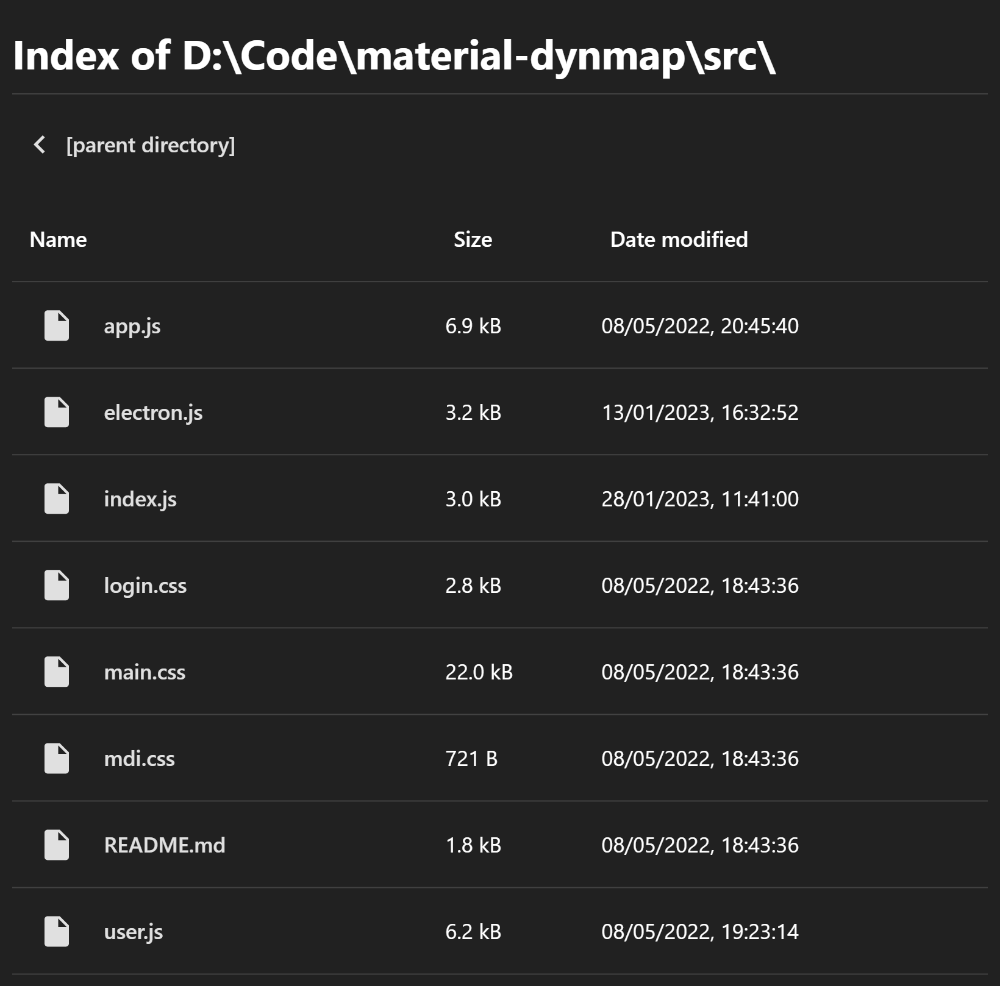

# `material-design-chromium-file-explorer`

This is a userstyle that makes the Chromium file explorer adopt Material Design guidelines.

- Icons are replaced with vectors from the Material Design iconset.
- Design cues such as whitespaces and accents are borrowed from Google Drive.
- Color scheme is inspired by Google Chrome's internal settings & extension dashboards.

## Credits

- The Material Design Guidelines and design system are authored by Google.
- Icons are designed by Google and the extended iconset by [**@Templarian**](https://github.com/Templarian).

## Screenshot

